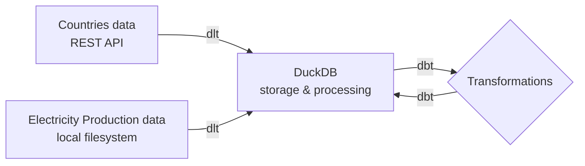

## About

This repository contains a sample end-to-end ELT pipeline which utilizes only open-source tools and publicly available data. The pipeline operates as follows:



1. Extraction and Loading - [dlt (data load tool)](https://dlthub.com/) is used to extract and load data from two different sources into the DuckDB database:
    - Countries Data - sources from the [REST Countries API](https://restcountries.com/).
    - Electricity Production Data - retrieved from [Kaggle](https://www.kaggle.com/datasets/ccanb23/iea-monthly-electricity-statistics/data) and ingested from the local filesystem.

2. Storage and Processing - [DuckDB](https://duckdb.org/) is used as database.

3. Transformations - [dbt (data build tool)](https://www.getdbt.com/) is used to transform the raw data into `staging` and `marts` models. A mapping seed is used to link countries named differently across the two datasets.

## Dependencies

This project uses Pipenv to create a virtual environment and keep track of dependencies. To run the project:

1. [Install Python](https://www.python.org/downloads/) if you haven't already
2. [Install Pipenv](https://pipenv.pypa.io/en/latest/installation.html)
3. In the root folder of the project, execute:

    ```pipenv install```

4. Execute the following command to activate the environment:

    ```pipenv shell```

## Running the ingestion pipelines

To run the dlt pipelines, execute the following command:

```python3 ingestion/run_pipelines.py```

This will create a new DuckDB persisted database in the root folder of the project. You can use tools like [DBeaver](https://dbeaver.io/download/) to explore the data.

## Running the transformations

To run the dbt transformations, navigate to the dbt project folder:

```cd transformations/electricity_production```

You need to execute the command below to install all dbt-specific dependencies first:

```dbt deps```

Optionally, you can execute `dbt debug` to ensure the connection between dbt and your DuckDB database works as expected. Then, execute the following command:

```dbt build```

This will materialize and test all models and seeds in your project.

## Running the data visualisation app

There is a very simple [Streamlit](https://streamlit.io/) app created for the project showcasing basic BI functionalities that are achievable using Streamlit. 


To launch it, navigate to the `visualisation` folder:

```cd visualisation```

Then, execute the following command:

```streamlit run dashboard.py```